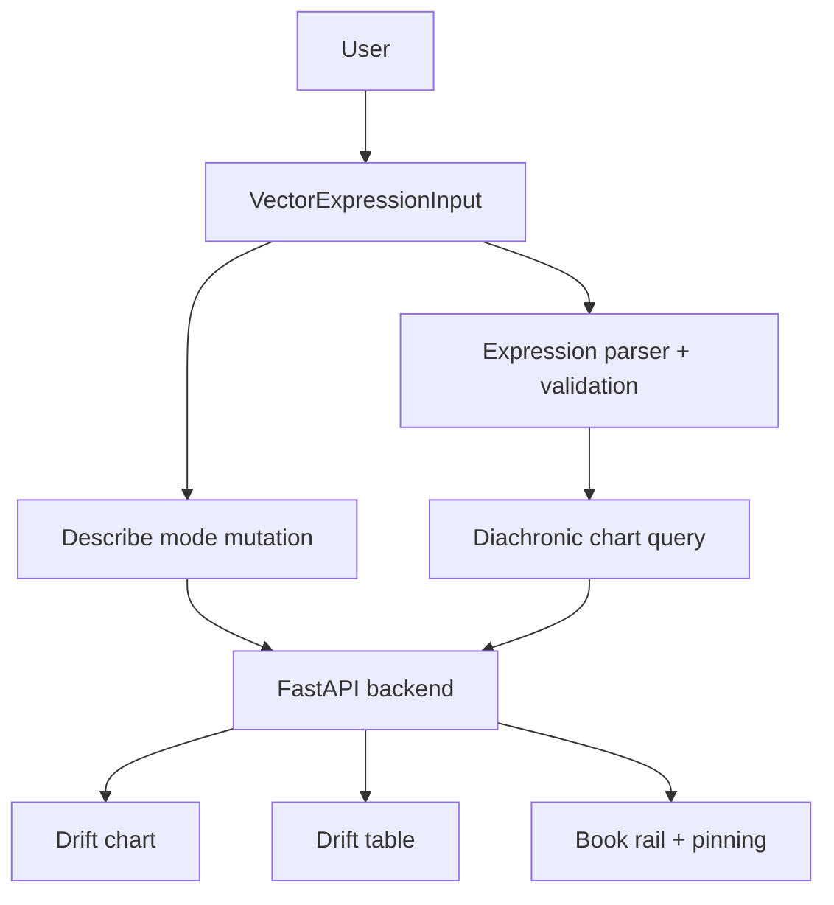

# Embedding Analytics: Frontend

A React/TypeScript application that turns a complex ML backend into a usable research workflow.

Users compose structured vector queries via a chip-based expression builder, translate plain-English questions into editable expressions through an LLM pipeline, and trace **definitional drift** — the change in how far authors agree on a term's sense — across a corpus ordered by publication year. Results reflect contextual proximity, not dictionary meaning: two terms score highly because the authors discuss them in similar contexts, not because they are synonyms.

**Live demo:** https://www.embedding-analytics.com
**Backend repo:** https://github.com/areebms/embedding-analytics

---

## Engineering highlights

- **Typed expression model:** Custom parser, hooks, and TypeScript types manage structured vector expressions as first-class state, not raw strings
- **Single-request chart data:** TanStack Query fetches the whole chart — the query's line, its neighbour lines, and every book's series — in one request, cached by expression and pinned book so editing and reverting a query costs nothing
- **Data visualization:** Multi-line definitional-drift chart on Recharts, read as focus + context — the query is the thick focal line, its neighbours are thin lines that connect only on hover, and each is named by an on-chart label in place of a legend. Where a book never uses a term the line breaks rather than interpolating across it
- **LLM-assisted input with human-in-the-loop:** Describe mode translates natural language into editable expression chips so the user always verifies the AI output before relying on it
- **Responsive layout:** Single-row desktop topbar collapses into a stacked mobile layout without sacrificing functionality
- **Product-facing technical UX:** Plain-language metric names carry the statistics alongside them so the interface stays approachable without hiding the analysis

---

## Tech stack

| Area | Tools |
|---|---|
| Framework | React, TypeScript, Vite |
| UI | MUI, Recharts with custom SVG marks |
| Data fetching | TanStack Query (queries, mutations) |
| State | Custom hooks, typed expression parser |
| Backend | FastAPI on AWS Lambda (separate repo) |

---

## Core features

### Vector expression input

A chip-based autocomplete wired to the backend vocabulary. Terms, operators (`+`, `-`), and parentheses are composed as discrete tokens. The parser validates structure in real time before any query is sent.

The vocabulary comes from `GET /terms`, sorted by how many books use each term (`TermResponse.books.length`). That field is `number[]` — the same book ids `GET /books` returns, so it joins directly against `BookResponse.id`. Only `.length` is read today, but the ids are there if the actual book list behind a term is ever worth showing.

Addition narrows context when a term has multiple meanings. `capital + profit` pulls "capital" toward its economic sense and away from the geographical one. Subtraction creates contrast directions:

```text
labour + (productive - unproductive)
```

### Describe mode

A plain-English input that translates to a vector expression through the backend LLM pipeline. The interpreted expression is shown as editable chips so the user can verify or adjust before relying on the result. If a term is not in the corpus, the closest match is substituted and flagged via a warning alert.

The user never stays in describe mode after submitting. It is a translation step, not a conversation.

### Diachronic drift chart

Recharts line chart on a continuous **publication-year** x-axis, so books sit at their real distance in time rather than in evenly spaced rank order. Each line follows one term — the query itself, plus the terms used closest to it — and its height is that term's **definitional agreement**: how closely it keeps the same company in each book.

The value behind it is the backend's `mean_local_similarity` — the similarity of two books' profiles over the query's 75 nearest shared terms, centred so that the shared height of those 75 does not dominate, which is why it can legitimately go negative and why the y-axis is never clamped at zero. It is not a cosine between two book vectors; no such vector exists, because the books are never placed in a shared frame — the [backend repo](https://github.com/areebms/embedding-analytics) documents the measurement under *What the score measures*.

The chart width follows its container.

The change in agreement along a line is **definitional drift** — a term keeping different company in later books than earlier ones. That slope, rather than any single point, is what the chart is for, and it is what `/semantic-drift` is named after.


---

## Data flow

One request draws the whole chart. `useSemanticDrift` posts the parsed expression to `/semantic-drift/{source_book_id}` when a book is pinned, or `/semantic-drift` when none is, and gets back the same `SemanticDriftResponse` either way:

- `expr` — the query's own line (`{ expr, terms, books }`)
- `comparative_terms` — one neighbour line each; how many is the server's call
- `books` — the roster: every book the request named, measured or not

The response is already one row per **term**, which is what the chart draws, so it is consumed as-is rather than reshaped. Absence is expressed by omission: a book appears on a line only if that line measured it, so `series.ts` derives each line's gaps by walking the roster.

The pinned book is excluded from the request — its agreement with itself is a constant 1.0, which carries no information, would compress the real variation into half the y-range, and is rejected by the API with a 422.

A 404 is one of two **results**, not failures, and they are told apart by `reason`:

| `reason` | meaning |
| --- | --- |
| `expression_absent` | the pinned book's vocabulary lacks a leaf of the expression (carries `book_id` and the missing `terms`) |
| `query_in_too_few_books` | fewer than four of the requested books carry the query — reachable while unpinned, where `book_id` is `null`. The pinned book does not count toward the four |

Both render as an `info` alert naming the actual book and words. `src/api/errors.ts` holds the `ApiError` carrier and the composers that turn one into a sentence; structure and copy are separate because naming a book needs the corpus, which the fetch layer does not have.

**Retries are for cold starts only.** The API is a Lambda behind a Function URL, so the first request after an idle period can fail on a timeout that says nothing about the query. `main.tsx` retries **once**, after 2s, and only when the failure could be transient — a network error or a 5xx. A 4xx is a deterministic answer about the expression itself, so retrying one would just delay the message the reader needs; `retryColdStart` returns false for every one of them. `refetchOnWindowFocus` is off, and responses are cached by expression, pinned book and target set, so editing and reverting a query costs nothing.



Product workflow:

1. Build or describe an expression
2. Validate and normalize into typed expression state
3. Request the whole chart for the current expression and pinned book
4. Render uncertainty-aware chart and table views
5. Refine the query without losing context

---

## Project structure

```text
src/
├── App.jsx
├── main.tsx
├── theme.ts                        # MUI theme + the one font stack layout.ts measures against
├── api/
│   ├── queries.ts                  # TanStack Query hooks: semantic drift, books, terms, describe
│   └── errors.ts                   # ApiError carrier + the composers that turn one into copy
├── components/
│   ├── DiachronicChart/
│   │   ├── index.jsx               # Suspense boundary; the chart itself is a lazy chunk
│   │   ├── Chart.jsx               # The Recharts chart
│   │   ├── ChartMessage.jsx        # Spinner and empty/error states, at chart height
│   │   ├── series.ts               # Payload -> one series per term; shared with ResultsTable
│   │   ├── types.ts                # The series shapes both the chart and the table read
│   │   ├── layout.ts               # Chart geometry + label measuring, importable without recharts
│   │   ├── marks.jsx               # Custom dots and on-chart term labels
│   │   └── palette.ts
│   ├── CompareBar/
│   │   ├── index.jsx
│   │   └── BookChip.jsx
│   ├── TopBar/
│   │   ├── index.jsx
│   │   ├── VectorExpressionInput.tsx
│   │   └── ComparativeTermsRanking.tsx # "Stable" / "Unstable"
│   ├── ResultsTable.jsx
│   └── GuideModal.jsx
├── content/
│   └── labels.ts                   # The copy the chart and the table must keep identical
├── hooks/
│   ├── useUrlState.ts              # Expression in ?q, ranking in ?sort, pinned book in the path
│   └── useVectorExpression.ts
├── types/
│   ├── api.ts                      # Mirrors the backend's pydantic schemas
│   └── vectorExpression.ts
└── utils/
    ├── vectorExpressionOptions.ts
    └── vectorExpressionParser.ts
```

---

## Running locally

```bash
npm install
npm run dev    # --> http://localhost:5173
```

Set `VITE_API_URL` to point at the backend API (local or deployed).

---

## Deployment (AWS Amplify Hosting)

The build itself is driven by `amplify.yml`. Two pieces of configuration live
outside it: the API URL and the SPA rewrite.

`VITE_API_URL` must be set as an Amplify **environment variable**, not in
`amplify.yml`. Vite inlines it at build time, so it has to exist when
`npm run build` runs — if it does not, every request goes to `undefined/...`
and the app fails with a generic "couldn't reach the server" message that
looks like a backend outage.

The app puts the pinned book in the URL **path** (`/overview/3`), so those
paths must reach `index.html` for the
client router to handle them. Amplify serves static objects, so without a
rewrite it looks for an object at that key, finds none, and 404s — every
shareable link and every refresh away from `/` fails in production, while
`npm run dev` works fine because Vite serves `index.html` for any path.

Amplify redirects are app-level settings, not build settings, so they cannot be
declared in `amplify.yml`. The rule matches every path with no file extension,
leaving real asset requests alone:

```json
[
  {
    "source": "</^[^.]+$/>",
    "target": "/index.html",
    "status": "200"
  }
]
```

Apply it once per Amplify app. Save the above as `amplify-redirects.json` and:

```bash
aws amplify update-app \
  --app-id "$AMPLIFY_APP_ID" \
  --custom-rules "$(cat amplify-redirects.json)"
```

or in the console: **Hosting → Rewrites and redirects → Manage redirects →**
open the JSON editor and paste the file's contents.

Verify after deploying by loading `https://<domain>/overview/3300` directly (not by
navigating to it from `/`) — it should render the app, not a 404.

---

## What this demonstrates

- Building a product frontend for an AI/ML backend, not just rendering API responses
- Modelling a chart's entire data contract as one cached request, keyed so that editing and reverting a query is free
- Designing data visualizations that expose uncertainty and support comparison, down to the custom SVG marks Recharts has no native form for
- Implementing a typed expression model with parsing, validation, and structured state
- Creating an LLM-assisted input flow with human-in-the-loop verification
- Shipping responsive, mobile-adapted UI over a technically dense domain
- Centralizing all user-facing copy and tooltip content for maintainability

---

## License

Apache-2.0

---

**Areeb Siddiqi** · [LinkedIn](https://www.linkedin.com/in/areeb-siddiqi/) · [GitHub](https://github.com/areebms)
