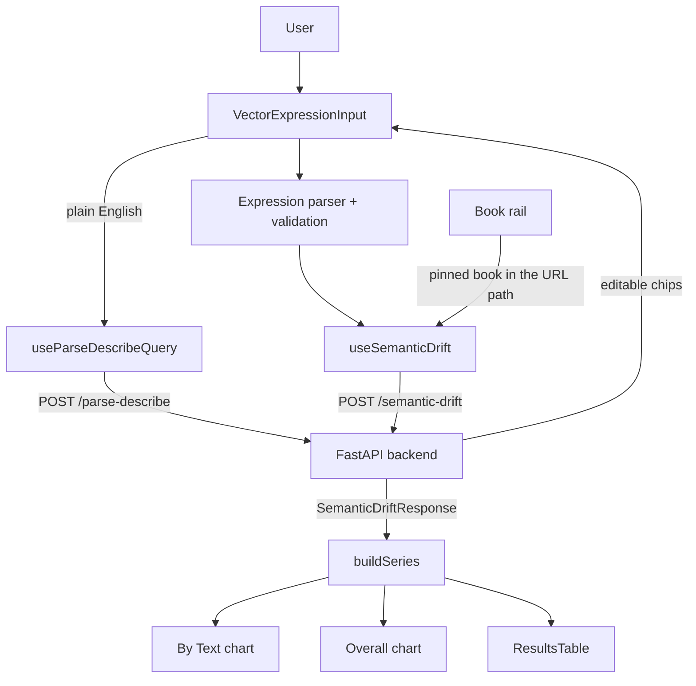

# Embedding Analytics: Frontend

A React/TypeScript frontend for Embedding Analytics, which measures how different texts use the same terms. Users build or describe a query, then compare its related terms across the collection of texts.

**Live demo:** https://www.embedding-analytics.com\
**Backend repo (main project):** https://github.com/areebms/embedding-analytics

---

## Queries

The search box is a chip-based autocomplete over the corpus vocabulary. Terms, operators and parentheses are separate tokens, and the expression is validated before any request is sent.

```text
capital + profit                        # + narrows a word to one sense
productive - unproductive               # - pushes an unwanted direction away
labour + (productive - unproductive)    # parentheses isolate the contrast first
```

**Describe** takes plain English instead. The backend's LLM translates it into an expression, which comes back as editable chips so you can check it before relying on it. Any term not in the corpus is replaced by its closest match and flagged.

```text
"productive vs unproductive labour"  →  labour + (productive - unproductive)
```

---

## Reading the charts

Every value is an **adjusted cosine similarity**: a term's similarity to the query inside one text, shifted so texts can be compared. The query's own line sits flat at the average baseline, and values are not clamped to [−1, 1]. Values from different queries cannot be compared. The [backend README](https://github.com/areebms/embedding-analytics#readme) explains the method, and its API docs give the [formula](https://github.com/areebms/embedding-analytics/blob/main/functions/api/README.md#adjusted-cosine).

The server returns two lists of related terms:

- **Consistent** (blue): highest mean similarity. Tied to the query across the collection.
- **Contested** (red): highest standard deviation. Close to the query in some texts but not others.

Two tabs show them:

- **Overall** plots each term once, mean against standard deviation.
- **By Text** draws one line per term over publication year, broken wherever a text never uses the term. The slope of a line is **definitional drift**: the term moving closer to or further from the query over time.

---

## Engineering highlights

- **Typed expression model:** a custom parser and TypeScript types keep queries as structured state, not raw strings
- **One request per chart:** TanStack Query fetches everything a view needs in a single cached call, so editing and reverting a query is free
- **Custom visualization:** Recharts with custom SVG marks, on-chart labels instead of a legend, and a scatter with collision-avoiding labels
- **Human-in-the-loop LLM input:** Describe output is always editable before it is used
- **Responsive layout:** the desktop top bar collapses into a stacked mobile layout
- **Plain-language UI:** all chart, tab and table copy lives in one module (`labels.ts`)

---

## Tech stack

| Area | Tools |
|---|---|
| Framework | React, TypeScript, Vite |
| UI | MUI, Recharts with custom SVG marks |
| Data fetching | TanStack Query (queries, mutations) |
| State | Custom hooks, typed expression parser |
| Routing | React Router (pinned book in the path, query and chart tab in the query string) |
| Backend | FastAPI on AWS Lambda (separate repo) |

---

## Data flow

`useSemanticDrift` posts the parsed expression to `/semantic-drift`, or to `/semantic-drift/{source_book_id}` when a book is pinned. One response draws everything: the query's line (`expr`), the two term lists (`top_mean`, `top_std`) and the books scored (`book_stats`). Responses are cached by expression, pinned book and target set.

A pinned book is the reference, not a target, so it is left out of `book_ids`. The API rejects it there with a 422.

A 404 is a result, not a failure, and is shown as an info alert:

| `reason` | meaning |
| --- | --- |
| `expression_absent` | the pinned book never uses part of the expression |
| `query_in_too_few_books` | fewer than a quarter of the requested books use the query |

The API runs on Lambda, so the first request after idling can time out. Requests retry **once**, after 2s, on a network error or 5xx only; a 4xx is a real answer and is never retried (`main.tsx`).



---

## Project structure

```text
src/
├── main.tsx, App.jsx, theme.ts
├── api/                  # TanStack Query hooks and API error handling
├── components/
│   ├── charts/           # Shared chart pieces: series building, layout, palette, tooltips
│   ├── DiachronicChart/  # By Text line chart
│   ├── OverviewChart/    # Overall scatter
│   ├── TopBar/           # Search box and expression input
│   ├── CompareBar/       # Book rail and pinning
│   ├── ResultsTable.jsx
│   └── GuideModal.jsx    # In-app guide
├── content/labels.ts     # All user-facing chart, tab and table copy
├── hooks/                # URL state and expression state
├── types/                # API types mirroring the backend schemas
└── utils/                # Expression parser and autocomplete options
```

---

## Running locally

```bash
npm install
npm run dev    # --> http://localhost:5173
```

Set `VITE_API_URL` to point at the backend API (local or deployed).

---

## Deployment (AWS Amplify Hosting)

`amplify.yml` drives the build. Two settings live outside it:

1. **`VITE_API_URL`** must be set as an Amplify environment variable. Vite inlines it at build time; without it every request goes to `undefined/...`.
2. **An SPA rewrite.** The pinned book lives in the URL path (`/overview/3300`), so every path without a file extension must serve `index.html`:

```json
[
  {
    "source": "</^[^.]+$/>",
    "target": "/index.html",
    "status": "200"
  }
]
```

Save it as `amplify-redirects.json` and apply it once per app (or paste it under **Hosting → Rewrites and redirects**):

```bash
aws amplify update-app \
  --app-id "$AMPLIFY_APP_ID" \
  --custom-rules "$(cat amplify-redirects.json)"
```

To verify, load `https://<domain>/overview/3300` directly. It should render the app, not a 404.

---

## License

Apache-2.0

---

**Areeb Siddiqi** · [LinkedIn](https://www.linkedin.com/in/areeb-siddiqi/) 